# Task Orchestrator

<p align="center">
  
</p>

<p align="center">
  <strong>Run AI coding backlogs unattended with provider failover, verification gates, and zero telemetry.</strong>
</p>

<p align="center">
  
  
  
  
</p>

<p align="center">
  <a href="#quickstart">Quickstart</a> •
  <a href="#worked-example-github-copilot-cli">Copilot Example</a> •
  <a href="#privacy--security">Privacy</a> •
  <a href="#providers-compatibility-matrix">Provider Matrix</a>
</p>

A production-minded, AI-agnostic orchestrator that drives coding-agent CLIs (Copilot, Claude, Codex, Kilo, and similar) through a task backlog with rate-limit-aware pacing and automatic provider/model fallback.

## Live Demo

<p align="center">
  
</p>

## Why People Use It

- Keeps moving when a provider hits 429/quota: auto-cooldown + rotate to next provider.
- Protects quality with optional verification gates before marking tasks complete.
- Runs unattended overnight, with resumable state and robust crash behavior.
- Stays privacy-first: no telemetry, no phone-home, no hidden cloud dependency.
- Works with tools you already use, instead of locking you into one AI vendor.

## Quickstart

```bash
# install
pip install task-orchestrator

# initialize in your project
task-orchestrator init

# validate setup
task-orchestrator validate

# preview without execution
task-orchestrator --dry-run

# run one task
task-orchestrator --once
```

## Providers Compatibility Matrix

| Provider CLI | Command Template | Prompt Mode | Tested | Notes |
|---|---|---|---|---|
| GitHub Copilot CLI | `copilot --allow-all-tools --no-ask-user -s -p {{TASK}}` | Arg (`{{TASK}}`) | Yes | `copilot login` required first |
| Claude Code | `claude -p --permission-mode bypassPermissions` | stdin | Yes | Set `ANTHROPIC_API_KEY` in `env` for API billing, or leave `env` empty to use an already-logged-in subscription session |
| Kilo Code | `kilo run --auto` | stdin | Yes | Use `--auto` for unattended runs |
| Codex CLI | `codex --quiet` | stdin | Partial | May require additional no-interactive flags |
| Ollama (local) | `ollama run codellama` | stdin | Partial | Good local fallback, no remote rate limits |

## Motivation

Free-tier and "auto" routed models (e.g. Kilo Code's Auto Free mode) stop responding after a burst of requests because the underlying provider rate-limits them. Running a long backlog of tasks by hand means babysitting the agent, watching for it to stall, and manually restarting it — which defeats the point of automation.

Two things were needed:

1. A way to space out requests so a single free provider doesn't get rate-limited as quickly.
2. A way to keep working even when a provider does get rate-limited, by switching to another available provider/model instead of sitting idle.

Prompting the agent itself to "wait 60 seconds and then continue" doesn't work — an LLM has no real clock or way to pause execution mid-conversation, and each task is typically a separate CLI invocation anyway. The delay and the failover both have to live outside the model, in a controlling process.

## Privacy & Security

**Task Orchestrator runs 100% offline.** It never phones home, never sends telemetry, and never touches your API keys:

- Zero network calls from the orchestrator itself — only your configured agent CLIs make outbound requests
- API keys stay in your local environment variables; they're never logged, uploaded, or stored in plain text
- Secrets in log output are automatically redacted
- No analytics, no tracking, no cloud dependency
- Fully auditable: single-file Python you can read end-to-end

Your code, your keys, your machine. Nothing leaves without you explicitly configuring a provider CLI to do so.

## Requirements

- Work through a checklist of tasks (`Todo.md`) one at a time, marking each complete as it finishes.
- Be agnostic to which coding agent CLI is actually doing the work, so the underlying tool can be swapped without rewriting the orchestrator.
- Support multiple providers/models (Anthropic, OpenRouter, Nvidia NIM, a local LM Studio server, etc.), each with its own credentials and launch command.
- Detect when a provider is rate-limited or exhausted, based on its output.
- When a provider is exhausted, automatically continue the same task on the next available provider instead of stopping or waiting for that specific provider to recover.
- If every configured provider is exhausted at the same time, wait until the soonest one becomes available again rather than failing outright.
- Apply a configurable delay between tasks even on success, to reduce the chance of re-triggering a limit.
- Optionally verify a task's result (build/lint/test commands) before marking it complete, and optionally auto-commit the result to git.
- Support both fully automatic operation and a manual-confirmation mode where a human reviews each task's output before it's marked done.
- Persist provider cooldown state across restarts, so relaunching the script doesn't immediately retry a provider that's still rate-limited.
- Log everything (per-attempt status, provider used, exit codes, verification results) to a file, not just the terminal.

## Tech Spec

- **Language:** Python 3, standard library only (`subprocess`, `json`, `re`, `time`, `pathlib`, `datetime`). No external dependencies to install.
- **Files:**
  - `orchestrator.py` — the orchestrator itself.
  - `task-orchestrator.config.json` — providers, delays, retry policy, verification commands.
  - `Todo.md` — the task backlog, using standard GitHub-flavored checkbox syntax (`- [ ]` / `- [x]`).
  - `prompts/task_prompt.txt` — template used to build the prompt sent to the agent for each task (`{{TASK}}` placeholder).
  - `state.json` — auto-created; records per-provider cooldown-until timestamps.
  - `logs/orchestrator.log` — auto-created; append-only human-readable run log.
  - `logs/orchestrator.jsonl` — auto-created when `--json-logs` (or `"json_logs": true` in `task-orchestrator.config.json`) is set; one JSON object per line, for downstream parsing/dashboards.
- **Providers:** each is a plain CLI launch — a command string plus an environment variable overlay (API keys, base URLs) plus a list of substrings/regex fragments that indicate a rate limit was hit. This makes a "provider" nothing more than "however you'd normally invoke your agent CLI with a specific model/backend," so it works with Anthropic's API, OpenRouter, Nvidia NIM's OpenAI-compatible endpoint, a local LM Studio server, or anything else reachable via a CLI flag or env var.
- **Process model:** each task attempt is a synchronous subprocess call. By default the prompt is piped to the agent CLI's stdin; if a provider's `command` contains a literal `{{TASK}}` token instead, the full prompt is substituted there as a single argv element and stdin is left empty (needed for CLIs like GitHub Copilot CLI, whose `-p <text>` takes the prompt as an argument, not stdin). Combined stdout/stderr is captured for rate-limit detection and written to `logs/orchestrator.log` (not the terminal) — an agent's full transcript can be thousands of lines, so it stays out of the way of the short per-task status lines the terminal shows. `verify_commands` failure output and provider `stats_command` output are handled the same way: a one-line pointer on the terminal, the full dump only in the log file.
- **State machine per task:** pick provider → run → check for rate-limit pattern → (if limited) cooldown that provider and rotate to next → (if not limited) verify → confirm/auto-accept → mark complete or retry/give up → sleep `delay_seconds` → next task.

## Solution / How It Works

```
Todo.md ──► next unchecked task
               │
               ▼
      pick next available provider (round-robin, skipping any on cooldown)
               │
               ▼
      run agent CLI with that provider's env + command, prompt piped to stdin
               │
               ▼
      output matches a rate-limit pattern?
        │                          │
       yes                        no
        │                          │
  mark provider on           run verify_commands (optional)
  cooldown, rotate                 │
  to next provider           require_manual_confirmation?
  (no delay — retry                │            │
   immediately)                   yes           no
        │                          │            │
        │                    ask y/n/retry   exit_code==0
        │                          │         and verified?
        └──────────┐               ▼            │
                    │        mark complete   mark complete
                    │        + git commit    + git commit
                    ▼               │            │
        (loop: try next            └─────┬──────┘
         provider for                    ▼
         same task)              sleep delay_seconds
                                         │
                                         ▼
                                  next task in Todo.md
```

If every provider is on cooldown at once, the orchestrator sleeps until the earliest cooldown expires, then re-checks — it never gives up as long as at least one provider will eventually free up.

### Configuration reference (`task-orchestrator.config.json`)

| Field | Purpose |
|---|---|
| `todo_file` | Path to the checklist file |
| `working_directory` | Directory the agent CLI and verification commands run in |
| `prompt_template` | Path to the prompt template file (`{{TASK}}` is replaced with the task text) |
| `delay_seconds` | Pause after each successfully completed task |
| `max_retries_per_provider` | Retries on the same provider before treating it as a failure (not used for rate-limit hits — those rotate immediately) |
| `tasks_per_batch` | Bundle up to this many pending tasks (default `1`, max `5`) into a single agent invocation and a single `verify_commands` run, amortizing build/test overhead across them. Completion is all-or-nothing for the whole batch — if verification fails or nothing changed, none of the batch's tasks are marked complete, the same as a single failed task today. |
| `require_manual_confirmation` | If `true`, you approve each task result (`y`/`n`/`retry`/`skip-provider`) before it's marked complete |
| `continue_on_failure` | If `false`, the orchestrator stops entirely on the first task that can't be completed |
| `auto_commit` | If `true`, runs `git add -A && git commit` after each completed task |
| `verify_commands` | Shell commands (e.g. `pytest`, `npm test`) that must all exit 0 for a task to count as verified |
| `verify_timeout_seconds` | Wall-clock timeout per `verify_commands` entry (default `1800`, `null` = no limit). Unlike the agent's own subprocess, a hanging build/test command isn't covered by stall detection — this is its only backstop. |
| `providers[]` | List of provider entries — see below |

Each entry in `providers`:

| Field | Purpose |
|---|---|
| `name` | Identifier used in logs and `state.json` |
| `enabled` | Set `false` to exclude a provider without deleting it |
| `command` | The CLI invocation for this provider (flags for model, base URL, etc.). Reads the prompt from stdin by default; include a literal `{{TASK}}` token to have the prompt passed as an argv element instead (for CLIs that take the prompt as a flag argument, not stdin) |
| `env` | Environment variables merged on top of the current environment (API keys, base URLs) |
| `rate_limit_patterns` | Lowercase substrings checked against the CLI's combined stdout/stderr; a match marks the provider exhausted |
| `cooldown_seconds` | How long an exhausted provider is skipped before being retried |

See `examples/` for ready-to-copy provider configs (`claude.json`, `copilot.json`, `multi-provider.json`) covering CLIs like `openrouter-free`, `anthropic-claude`, `nvidia-nim`, and `lmstudio-local`-style setups. The `command` strings and `rate_limit_patterns` in those examples are placeholders; they need to be adjusted to match your actual CLI's flags and the exact wording it prints on a rate limit, since that wording varies by tool and provider. `task-orchestrator.config.json` itself is gitignored by default (see `init`) since providers commonly hold API keys.

### Optional fields

| Field | Purpose |
| |--- |
| `priority` | Integer priority for provider selection (higher = preferred). When any provider has an explicit priority, the orchestrator picks the highest-priority available provider. Providers without a `priority` default to `0`. |

### Adding a new provider

A provider is anything the orchestrator can launch as a subprocess. To add one:

1. Choose a unique `name` for the provider.
2. Write the exact CLI command in `command`. The orchestrator uses `shlex.split()` to parse it, so you can safely include quoted arguments and paths with spaces.
3. Set any required credentials in `env`.
4. Provide `rate_limit_patterns` — lowercase substrings that appear in the CLI's output when the underlying API returns `429`, quota exhaustion, or similar limits.
5. Set `cooldown_seconds` to determine how long the provider is skipped after a rate-limit hit.

Example:

```json
{
  "name": "my-new-provider",
  "enabled": true,
  "command": "my-agent-cli --auto --model some-model",
  "env": { "MY_API_KEY": "REPLACE_ME" },
  "rate_limit_patterns": ["rate limit", "429", "quota exceeded"],
  "cooldown_seconds": 3600
}
```

### Worked example: GitHub Copilot CLI

[GitHub Copilot CLI](https://docs.github.com/copilot/concepts/agents/about-copilot-cli) (`copilot`) works as a provider and has been verified end-to-end (real task run via `--once`, file created, task marked complete).

**Requirements:**

- Install it and authenticate once, outside the orchestrator: `copilot login` (interactive; the orchestrator itself only ever runs it non-interactively).
- Unlike `kilo`/`claude`, Copilot CLI's `-p/--prompt` flag takes the prompt as a CLI argument, not stdin — so `command` **must** include the literal `{{TASK}}` token (see the `command` field note above). Without it, the orchestrator would pipe the prompt to stdin as usual and Copilot would just sit there with no prompt.
- `--allow-all-tools` is required for non-interactive use (Copilot CLI prompts for tool approval by default; the startup linter warns if it's missing). `--no-ask-user` additionally stops it from pausing mid-task to ask a clarifying question — since nothing is watching an unattended run, always include it. `-s`/`--silent` keeps its output free of progress decoration, which matters for the rate-limit/suspicious-completion substring checks.

```json
{
  "name": "copilot",
  "enabled": true,
  "command": "copilot --allow-all-tools --no-ask-user -s -p {{TASK}}",
  "env": {},
  "rate_limit_patterns": ["rate limit", "429", "quota exceeded", "too many requests"],
  "cooldown_seconds": 300
}
```

By default this uses whatever models your logged-in Copilot account has access to. Copilot CLI also supports pointing at a custom OpenAI-compatible endpoint (a local LM Studio server, or a gateway like OmniRoute) via `COPILOT_PROVIDER_BASE_URL` / `COPILOT_PROVIDER_TYPE` / `COPILOT_PROVIDER_API_KEY` / `COPILOT_MODEL` in the provider's `env` — not wired up yet here, but the mechanism is documented and works the same way as any other provider's `env` overlay.

## Usage

1. Fill in real API keys and correct CLI flags in `task-orchestrator.config.json` for each provider you want to use; set `enabled: false` on any you don't.
2. Edit `Todo.md` with your real task list.
3. Run:
   ```
   python orchestrator.py
   ```
4. Watch `logs/orchestrator.log` (or the terminal) for progress; if `require_manual_confirmation` is `true`, respond to the prompt after each attempt.

### Copilot-First Run (Windows/PowerShell)

This repo includes a Copilot-only config and PowerShell helpers so you can run Todo tasks with GitHub Copilot CLI without editing the default config.

Files:

- `task-orchestrator.config.copilot.json` — Copilot-only provider, unattended mode, verification via `python -m unittest discover -s tests`
- `run_copilot.ps1` — runs `orchestrator.py` with `--config task-orchestrator.config.copilot.json`
- `run_forever.ps1` — PowerShell supervisor equivalent to `run_forever.sh`

Examples:

```powershell
# Preview next task/provider (no execution)
./run_copilot.ps1 --dry-run

# Run one task and stop
./run_copilot.ps1 --once

# Run continuously with JSON logs
./run_copilot.ps1 --json-logs

# Crash-restart supervisor mode
./run_forever.ps1 --config task-orchestrator.config.copilot.json
```

Prerequisites:

- `copilot` CLI installed and authenticated (`copilot login`)
- A Python interpreter on `PATH` as `python`, `python3`, or `py` (the `.ps1` scripts and `verify_commands` all auto-detect whichever is available)

### CLI flags

- `--config <path>` — use a non-default config file
- `--dry-run` — print the next task and provider without executing anything
- `--dry-run-prompt` — print the exact prompt that would be sent for the next pending task, without executing anything
- `--once` — run a single task and exit
- `--json-logs` — append structured JSON log lines to `logs/orchestrator.jsonl` alongside normal logs
- `--summary` — print a summary of today's run statistics (tasks completed, success rate, total run time, average time per task) and exit
- `--list-tasks [N]` / `--peek [N]` — preview the next N pending tasks (default 10) with provider selection simulation, without executing anything
- `--provider <name>` — force a specific provider by name for this run, ignoring the others entirely (its own cooldown still applies)
- `--task "text"` — run a single ad-hoc task immediately without reading or modifying `Todo.md`
- `--resume-from <text>` — skip pending tasks in `Todo.md` until reaching the first one containing this text, then proceed normally for the rest of this run (`Todo.md` itself is not modified)
- `--skip-section <name>` — exclude tasks under a `Todo.md` section from being processed (repeatable)
- `--concurrency <N>` — run up to N `[parallel]`-tagged tasks concurrently

### Subcommands

- `task-orchestrator init` — scaffold a new project's `task-orchestrator.config.json`, `Todo.md`, `prompts/task_prompt.txt`, and `.gitignore` in the current directory (never overwrites existing files)
- `task-orchestrator validate` — check config structure, provider executable reachability, git working tree, and `Todo.md` presence, without running anything

## Known Limitations / Follow-ups

- Rate-limit detection is text-pattern matching against CLI output, not a structured API response — patterns need to be tuned per tool/provider and may need updates if a CLI changes its error wording.
- Providers are tried round-robin by default, but you can set a `priority` field to prefer specific providers (higher = preferred).
- "Did the agent actually do anything?" (used to catch false-success completions and to confirm a rate-limit pattern match wasn't a false positive on real work) is decided via `git status --porcelain` in `working_directory`. That means any file your own tooling leaves untracked in that directory looks like "the agent changed something" — make sure `state.json`, `orchestrator.pid`, and `logs/` (all auto-created) are in `.gitignore`, or every task will look suspicious-free/rate-limit-free even when it isn't.

## Security / Threat Model

**Trusted-input assumption**: Task text from `Todo.md` flows into subprocess arguments (via `shlex.split` and `{{TASK}}` substitution). The orchestrator assumes Todo.md is authored by a trusted user — it does NOT sanitize task text for shell injection because:

1. Provider commands are launched with `shell=False` (never `shell=True`), so shell metacharacters in task text have no special meaning.
2. The `{{TASK}}` substitution inserts the prompt as a single argv element, not interpreted by a shell.
3. `shlex.split()` is used only on the provider `command` string from config (also trusted), never on task text.

**What this means for you**: Don't point the orchestrator at an untrusted Todo.md (e.g. one that could be modified by an attacker). In a CI context, ensure the Todo.md source is protected by the same access controls as your code.

**Secret handling**: Provider `env` values that look like API keys are redacted from log output. Use `$VAR_NAME` interpolation in config to avoid storing secrets on disk at all. `task-orchestrator init` also gitignores `task-orchestrator.config.json` by default, so even a literal key pasted into `env` doesn't get committed by accident — if you're adding the config to an existing project's `.gitignore` by hand, make sure that entry is there.

## Providers Compatibility Matrix

| Provider CLI | Command Template | Stdin/Arg | Tested | Notes |
|---|---|---|---|---|
| GitHub Copilot CLI | `copilot --allow-all-tools --no-ask-user -s -p {{TASK}}` | Arg | ✅ | Requires `copilot login` first |
| Claude Code | `claude -p --permission-mode bypassPermissions` | Stdin | ✅ | Set `ANTHROPIC_API_KEY` in `env` for API billing, or leave `env` empty for an already-logged-in subscription session |
| Kilo Code | `kilo run --auto` | Stdin | ✅ | Interactive by default; `--auto` required |
| Codex CLI | `codex --quiet` | Stdin | Untested | May need `--no-interactive` |
| Aider | `aider --yes --message {{TASK}}` | Arg | Untested | Auto-confirms with `--yes` |
| Ollama (local) | `ollama run codellama` | Stdin | Untested | No rate limits (local) |

## Dashboard

A minimal local dashboard is served via Python's stdlib `http.server` — no external dependencies required. It exposes the current run state (active task, provider status, recent history) as both JSON and an HTML page.

### Enabling

Set `dashboard_port` in `task-orchestrator.config.json` to the port you want the dashboard to listen on:

```json
{
  "dashboard_port": 8080
}
```

When `dashboard_port` is `null` (the default), the dashboard is disabled.

Optional dashboard config:

- `dashboard_retry_on_port_in_use` (default `true`) — if the configured port is busy, retry on the next ports
- `open_dashboard_in_browser` (default `false`) — open dashboard URL in your default browser at startup

### Endpoints

| Path | Content-Type | Description |
|---|---|---|
| `/` | `text/html` | Human-readable dashboard with auto-refresh (5s) |
| `/api/state` | `application/json` | Machine-readable current run state |

## Interactive Commands (Optional)

Set `interactive_commands: true` in `task-orchestrator.config.json` to enable non-blocking keyboard commands during runs in an interactive terminal:

- `p` then Enter — pause after current task
- `r` then Enter — resume from pause
- `s` then Enter — skip current task once (task stays unchecked; no reorder in `Todo.md`)
- `q` then Enter — graceful quit

Optional visual/audio flags (all default `false`):

- `flair_mode`
- `ascii_progress`
- `provider_glyphs`
- `audio_notifications`

### JSON response shape (`/api/state`)

```json
{
  "current_task": "Task one",
  "current_provider": "kilo",
  "providers": [
    {"name": "kilo", "available": true, "cooldown_until": null}
  ],
  "history": [
    {"task": "Task one", "provider": "kilo", "status": "complete", "timestamp": "2026-07-24T11:45:58"}
  ],
  "uptime_seconds": 123.4
}
```
