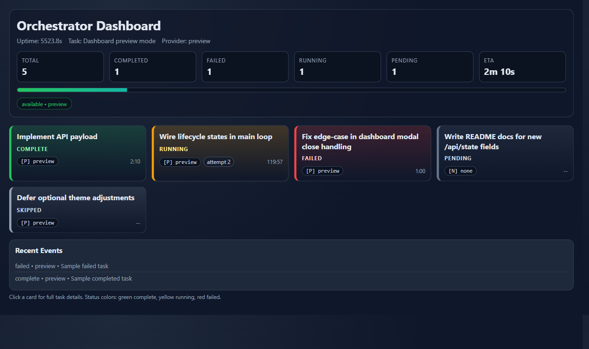
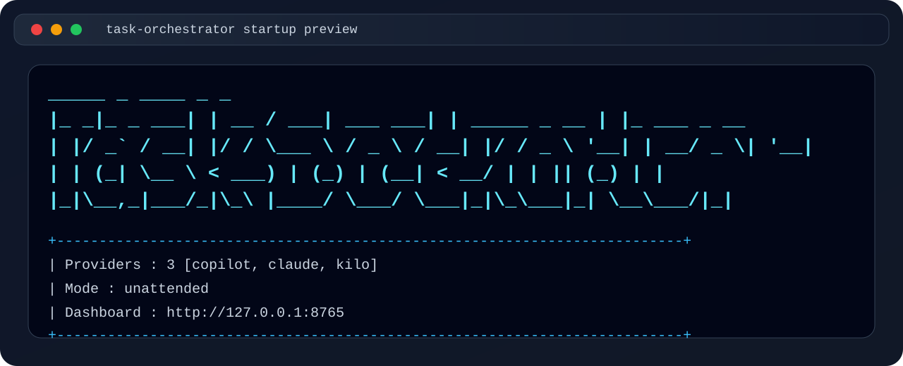

# Dashboard V2

Dashboard V2 introduces a card-based run board with live status updates, richer task metadata, and a clearer startup experience.

## Screenshot



## What Is New

- Card-based task board replaces the legacy table-like layout.
- Status-coded cards for `pending`, `running`, `complete`, `failed`, and `skipped`.
- Running-task live duration counter (updates every second).
- Header run summary with totals, progress, elapsed time, and ETA.
- Provider status chips with `available` and `cooldown` countdowns.
- Click-to-open task detail modal with timestamps, duration, exit code, verification result, and error summary.
- Incremental refresh every 3 seconds to avoid full-DOM redraw flicker.
- Completion/failure highlight animation to draw attention to state changes.

## Startup UX Improvement

When the orchestrator starts with dashboard enabled, it prints a clickable dashboard URL exactly once at startup, for example:



```text
Dashboard URL: http://127.0.0.1:8765
```

This line is intentionally emitted at startup only (not at the end of the run), so users can open the dashboard immediately from cmd/PowerShell. The startup banner also shows a large multi-line Task Orchestrator title plus provider count, run mode, and dashboard address.

## API Additions (Backward-Compatible)

`/api/state` keeps existing fields and adds:

- `tasks`: full task card dataset (status, timing, provider, attempts, verification, errors)
- `run_summary`: total/completed/failed/running/pending and ETA data

These fields are additive and do not break existing consumers using the prior response shape.

## Behavior Notes

- Dashboard is local-only (`127.0.0.1`) and served from the standard-library HTTP server.
- No external UI framework or build step is required.
- The dashboard remains responsive on desktop and mobile.
